# 节假日关闭模式预测系统文档

## 目录
1. [系统概述](#系统概述)
2. [架构设计](#架构设计)
3. [核心类与函数](#核心类与函数)
4. [工具函数流程图](#工具函数流程图)
5. [数据流](#数据流)
6. [线程同步机制](#线程同步机制)
7. [配置参数](#配置参数)
8. [使用示例](#使用示例)

---

## 系统概述

节假日关闭模式预测系统（Holiday Off Mode Prediction System）是一个专门针对处于假期模式的站点进行负荷预测的多模型并行调度系统。

### 主要特点
- **多模型融合**: 同时运行 DLinear、TimeXer、XGBoost 三种模型
- **假期数据过滤**: 自动识别并过滤假期模式时间段的数据
- **多时区支持**: 为不同时区独立创建预测线程
- **定时调度**: 支持定时调度模式（每天20:00）和按需调用模式
- **线程安全**: 使用锁机制保护深度学习模型的并发访问

### 核心功能
1. 从 `sigen_ai.station_mode_operation_log` 获取假期模式操作记录
2. 构建假期时间段mask，过滤假期数据
3. 使用过滤后的正常工作数据进行预测
4. 支持夏令时(DST)和冬令时(WST)校正
5. 将预测结果写入Kafka消息队列
6. 自动选择最优模型

---

## 架构设计

### 系统架构图

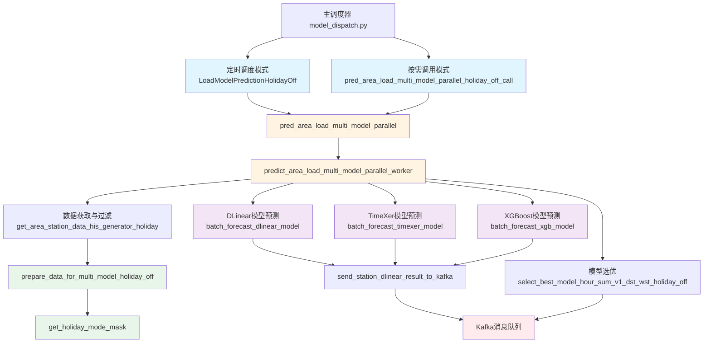

### 模块划分

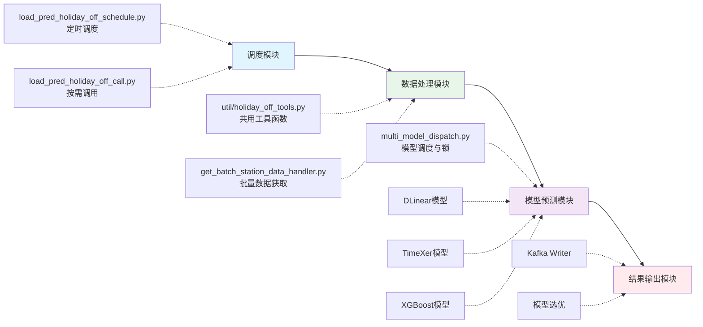

---

## 核心类与函数

### 1. LoadModelPredictionHolidayOff 类

#### 类定义
```python
class LoadModelPredictionHolidayOff(threading.Thread):
    def __init__(self, time_area, mode=1, exp_dlinear=None, exp_timexer=None, lock=None, global_white_list=[]):
        """
        节假日关闭模式预测线程

        Args:
            time_area: 时区名称 (如 'Europe/Berlin')
            mode: 运行模式 (1=定时调度, 2=单次运行)
            exp_dlinear: DLinear模型实例
            exp_timexer: TimeXer模型实例
            lock: 线程锁（用于TimeXer模型同步）
            global_white_list: XGBoost白名单站点列表
        """
```

#### 初始化流程图

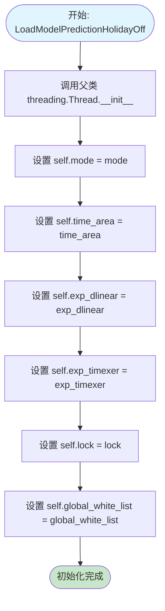

#### 线程运行流程图

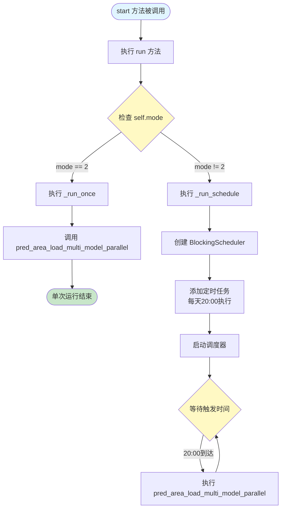

---

### 2. pred_area_load_multi_model_parallel 函数

#### 函数签名
```python
def pred_area_load_multi_model_parallel(
    time_area,               # 时区名称
    pred_now_date=None,      # 预测基准日期（可选）
    exp_dlinear=None,        # DLinear模型实例
    exp_timexer=None,        # TimeXer模型实例
    lock=None,               # 线程锁
    global_white_list=[],    # XGB白名单
    global_holiday_off_list=[]  # 节假日关闭站点列表
):
    """
    主调度函数：多模型预测调度（定时调度模式）

    Returns:
        bool: 执行成功返回True，失败返回False
    """
```

#### 主调度流程图

```mermaid
flowchart TD
    Start([开始: pred_area_load_multi_model_parallel]) --> InitLock2[初始化 lock2 = lock]
    InitLock2 --> GetTimezone[获取时区 pytz.timezone]
    GetTimezone --> CalcTargetTime[计算目标时间<br/>target_time = now + 1天]
    CalcTargetTime --> CalcPredDate[计算预测基准日期<br/>pred_now_date = target_time - 1天]

    CalcPredDate --> CheckDST{检查是否有夏令时}
    CheckDST -->|有| GetGapTime[获取夏令时缺失小时<br/>get_loss_hour]
    CheckDST -->|无| CheckWST{检查是否有冬令时}
    GetGapTime --> CheckWST

    CheckWST -->|有| GetWinterTime[获取冬令时重复小时<br/>get_repeat_hour]
    CheckWST -->|无| GetAIStation[获取该地区AI站点列表<br/>get_ai_station]
    GetWinterTime --> GetAIStation

    GetAIStation --> GetHolidayList[获取节假日关闭站点<br/>get_ai_station_holiday_off]
    GetHolidayList --> CalcIntersection[计算交集<br/>holiday_list ∩ ai_station]

    CalcIntersection --> CheckEmpty{节假日列表是否为空?}
    CheckEmpty -->|是| LogWarning[记录警告日志]
    LogWarning --> ReturnFalse([返回 False])

    CheckEmpty -->|否| LogInfo[记录站点信息日志]
    LogInfo --> CreateThreadLock[创建线程锁]
    CreateThreadLock --> GetThreadPool[获取统一线程池<br/>get_thread_pool_executor]

    GetThreadPool --> SubmitWorker[提交 worker 任务<br/>predict_area_load_multi_model_parallel_worker]
    SubmitWorker --> WaitComplete{等待任务完成}

    WaitComplete -->|成功| Sleep60[等待60秒]
    WaitComplete -->|异常| LogError[记录错误日志]
    LogError --> ReturnFalse2([返回 False])

    Sleep60 --> LogOptimize[记录选优开始日志]
    LogOptimize --> LoopStations[遍历节假日关闭站点]

    LoopStations --> SelectBest[调用选优函数<br/>select_best_model_hour_sum_v1_dst_wst_holiday_off]
    SelectBest --> CheckMoreStations{还有更多站点?}
    CheckMoreStations -->|是| LoopStations
    CheckMoreStations -->|否| ReturnTrue([返回 True])

    style Start fill:#e1f5ff
    style CheckDST fill:#fff9c4
    style CheckWST fill:#fff9c4
    style CheckEmpty fill:#fff9c4
    style WaitComplete fill:#fff9c4
    style CheckMoreStations fill:#fff9c4
    style ReturnTrue fill:#c8e6c9
    style ReturnFalse fill:#ffcdd2
    style ReturnFalse2 fill:#ffcdd2
```

---

### 3. predict_area_load_multi_model_parallel_worker 函数

#### Worker流程图

```mermaid
flowchart TD
    Start([开始: Worker线程]) --> InitVars[初始化变量<br/>global_white_list, global_holiday_off_list]
    InitVars --> GetTimeZone[获取时区名称]
    GetTimeZone --> CalcPredDate{pred_now_date是否为None?}

    CalcPredDate -->|是| UseCurrentTime[使用当前时区时间]
    CalcPredDate -->|否| UseProvidedDate[使用提供的日期]
    UseCurrentTime --> RemoveTZ[移除时区信息]
    UseProvidedDate --> RemoveTZ

    RemoveTZ --> CalcTargetDate[计算预测日期<br/>pred_date = pred_now_date + 1天]
    CalcTargetDate --> GetDataGen[获取批量数据生成器<br/>get_area_station_data_his_generator_holiday]

    GetDataGen --> InitCounters[初始化计数器<br/>batch_count=0, total_station_count=0]
    InitCounters --> LoopBatches{遍历批次数据}

    LoopBatches -->|有数据| IncrBatch[batch_count++]
    IncrBatch --> PrepareData[准备多模型数据<br/>prepare_data_for_multi_model_holiday_off]

    PrepareData --> CheckEmpty{数据是否为空?}
    CheckEmpty -->|是| LogWarn[记录警告日志]
    LogWarn --> LoopBatches

    CheckEmpty -->|否| TryDLinear[尝试DLinear预测]
    TryDLinear --> DLinearPred[batch_forecast_dlinear_model]
    DLinearPred --> CatchDLinearErr{捕获异常?}
    CatchDLinearErr -->|是| LogDLinearErr[记录DLinear错误]
    CatchDLinearErr -->|否| TryTimeXer[尝试TimeXer预测]
    LogDLinearErr --> TryTimeXer

    TryTimeXer --> AcquireLock[尝试获取TimeXer锁]
    AcquireLock --> LockAcquired{获取锁成功?}
    LockAcquired -->|是| TimeXerPred[batch_forecast_timexer_model]
    TimeXerPred --> ReleaseLock[释放锁]
    ReleaseLock --> TryXGB[尝试XGBoost预测]
    LockAcquired -->|否| TryXGB

    TryXGB --> FilterWhitelist[过滤白名单站点<br/>selected_indices]
    FilterWhitelist --> XGBPred[batch_forecast_xgb_model]
    XGBPred --> CatchXGBErr{捕获异常?}
    CatchXGBErr -->|是| LogXGBErr[记录XGB错误]
    CatchXGBErr -->|否| Cleanup[清理内存<br/>del batch_np, batch_df<br/>gc.collect]
    LogXGBErr --> Cleanup

    Cleanup --> LoopBatches
    LoopBatches -->|无更多数据| End([Worker完成])

    style Start fill:#e1f5ff
    style CalcPredDate fill:#fff9c4
    style LoopBatches fill:#fff9c4
    style CheckEmpty fill:#fff9c4
    style CatchDLinearErr fill:#fff9c4
    style LockAcquired fill:#fff9c4
    style CatchXGBErr fill:#fff9c4
    style End fill:#c8e6c9
```

---

### 4. pred_area_load_multi_model_parallel_holiday_off_call 函数

#### 按需调用流程图

```mermaid
flowchart TD
    Start([开始: holiday_off_call<br/>参数: station_id, update_time, holiday_mode]) --> GetTimeZone[获取站点时区<br/>db_conn_global.get_ai_area_by_station_id]
    GetTimeZone --> CheckTimeZone{时区列表是否为空?}

    CheckTimeZone -->|是| LogNoTimezone[记录错误: 无法获取时区]
    LogNoTimezone --> ReturnEarly1([返回])

    CheckTimeZone -->|否| ExtractTimeZone[提取时区: time_area = time_area_list]
    ExtractTimeZone --> GetCurrentTime[获取当前时间<br/>datetime.now]

    GetCurrentTime --> ValidateHolidayMode{holiday_mode == 0?}
    ValidateHolidayMode -->|否| LogWrongMode[记录警告: holiday_mode不为0]
    LogWrongMode --> ReturnFalse1([返回 False])

    ValidateHolidayMode -->|是| ParseUpdateTime[解析 update_time]
    ParseUpdateTime --> CheckTimeType{update_time类型?}

    CheckTimeType -->|int/float| ParseTimestamp[解析为时间戳<br/>pd.to_datetime]
    CheckTimeType -->|str| TryParseStr{尝试解析字符串}
    CheckTimeType -->|datetime| UseDatetime[直接使用datetime]

    TryParseStr -->|数字字符串| ParseAsInt[转换为int后解析]
    TryParseStr -->|日期字符串| ParseFormat[尝试不同格式<br/>%Y-%m-%d %H:%M:%S<br/>%Y-%m-%d]

    ParseTimestamp --> ConvertTZ[转换到站点时区<br/>tz_convert]
    ParseAsInt --> ConvertTZ
    ParseFormat --> ConvertTZ
    UseDatetime --> RemoveTZInfo[移除时区信息]
    ConvertTZ --> RemoveTZInfo

    RemoveTZInfo --> CompareDate{update_time日期 == 当前日期?}
    CompareDate -->|否| LogDateMismatch[记录警告: 日期不一致]
    LogDateMismatch --> ReturnEarly2([返回])

    CompareDate -->|是| ReadWhitelist[从Redis读取白名单<br/>read_white_list_from_redis]
    ReadWhitelist --> CheckWhitelist{白名单是否为空?}
    CheckWhitelist -->|是| LogEmptyWhitelist[记录警告: 白名单为空]
    LogEmptyWhitelist --> UseEmptyList[使用空列表]
    CheckWhitelist -->|否| LogWhitelistOK[记录: 白名单读取成功]

    UseEmptyList --> CheckUpdateHour{update_time小时 >= 20?}
    LogWhitelistOK --> CheckUpdateHour
    CheckUpdateHour -->|是| SetLateFlag[设置 is_update_time_late = True]
    CheckUpdateHour -->|否| SetNormalFlag[设置 is_update_time_late = False]

    SetLateFlag --> LogConditionOK[记录: 满足节假日关闭预测条件]
    SetNormalFlag --> LogConditionOK

    LogConditionOK --> SetPredDate{update_datetime存在?}
    SetPredDate -->|是| UseUpdateDate[使用 update_datetime作为基准日期]
    SetPredDate -->|否| UseCurrentDate[使用当前时间作为基准日期]

    UseUpdateDate --> CreateStationList[创建站点列表<br/>global_holiday_off_list = station_id]
    UseCurrentDate --> CreateStationList

    CreateStationList --> CreateLock[创建线程锁]
    CreateLock --> CallPred1[调用预测函数<br/>pred_area_load_multi_model_parallel<br/>今天+明天]

    CallPred1 --> Catch1{捕获异常?}
    Catch1 -->|是| LogErr1[记录错误日志]
    Catch1 -->|否| LogSuccess1[记录成功日志]

    LogErr1 --> CheckLate{is_update_time_late?}
    LogSuccess1 --> CheckLate

    CheckLate -->|是| CallPred2[调用预测函数<br/>pred_area_load_multi_model_parallel<br/>明天+后天<br/>pred_now_date + 1天]
    CheckLate -->|否| Sleep60[等待60秒]

    CallPred2 --> Catch2{捕获异常?}
    Catch2 -->|是| LogErr2[记录错误日志]
    Catch2 -->|否| LogSuccess2[记录成功日志]

    LogErr2 --> Sleep60
    LogSuccess2 --> Sleep60

    Sleep60 --> LogOptimize[记录: 开始选优]
    LogOptimize --> SelectBest1[选优: 今天+明天<br/>select_best_model_hour_sum_v1_dst_wst_holiday_off<br/>pred_now_date - 1天]

    SelectBest1 --> CatchOpt1{捕获异常?}
    CatchOpt1 -->|是| LogOptErr1[记录选优失败]
    CatchOpt1 -->|否| LogOptSuccess1[记录选优成功]

    LogOptErr1 --> CheckLate2{is_update_time_late?}
    LogOptSuccess1 --> CheckLate2

    CheckLate2 -->|是| SelectBest2[选优: 明天+后天<br/>select_best_model_hour_sum_v1_dst_wst_holiday_off<br/>pred_now_date]
    CheckLate2 -->|否| End([结束])

    SelectBest2 --> CatchOpt2{捕获异常?}
    CatchOpt2 -->|是| LogOptErr2[记录选优失败]
    CatchOpt2 -->|否| LogOptSuccess2[记录选优成功]

    LogOptErr2 --> End
    LogOptSuccess2 --> End

    style Start fill:#e1f5ff
    style CheckTimeZone fill:#fff9c4
    style ValidateHolidayMode fill:#fff9c4
    style CheckTimeType fill:#fff9c4
    style TryParseStr fill:#fff9c4
    style CompareDate fill:#fff9c4
    style CheckWhitelist fill:#fff9c4
    style CheckUpdateHour fill:#fff9c4
    style SetPredDate fill:#fff9c4
    style Catch1 fill:#fff9c4
    style CheckLate fill:#fff9c4
    style Catch2 fill:#fff9c4
    style CatchOpt1 fill:#fff9c4
    style CheckLate2 fill:#fff9c4
    style CatchOpt2 fill:#fff9c4
    style End fill:#c8e6c9
    style ReturnEarly1 fill:#ffcdd2
    style ReturnEarly2 fill:#ffcdd2
    style ReturnFalse1 fill:#ffcdd2
```

---

## 工具函数流程图

### 1. get_holiday_mode_mask

#### 函数签名
```python
def get_holiday_mode_mask(station_id, start_timestamp, end_timestamp):
    """
    获取某个站点在指定时间范围内的假期模式时间段mask

    Args:
        station_id: 站点ID
        start_timestamp: 开始时间戳
        end_timestamp: 结束时间戳

    Returns:
        set: 需要mask掉的时间戳集合（5分钟间隔）
    """
```

#### 流程图

```mermaid
flowchart TD
    Start([开始: get_holiday_mode_mask<br/>station_id, start_timestamp, end_timestamp]) --> ConvertDates[转换时间戳为日期<br/>start_date, end_date]

    ConvertDates --> ExtendStart[扩大查询范围<br/>extended_start = start - 60天]
    ExtendStart --> QueryDB[查询数据库<br/>get_station_mode_operation_log<br/>mode_type=2假期模式]

    QueryDB --> CheckData{查询结果是否为空?}
    CheckData -->|是| ReturnEmpty([返回空集合 set])

    CheckData -->|否| InitVars[初始化变量<br/>holiday_periods = []<br/>current_start = None<br/>current_end = None]

    InitVars --> LoopRows{遍历查询结果}
    LoopRows -->|有数据| ParseRow[解析行数据<br/>dt, mode_type, operation_type,<br/>operation_time, record_time]

    ParseRow --> CheckOpType{operation_type?}

    CheckOpType -->|1 开启| CheckState1{current_start状态?}
    CheckState1 -->|有start且有end| SavePeriod1[保存时间段<br/>holiday_periods.append]
    SavePeriod1 --> SetNewStart1[设置新开始时间<br/>current_start = operation_time<br/>current_end = None]

    CheckState1 -->|start为None| SetStart[设置开始时间<br/>current_start = operation_time<br/>current_end = None]
    CheckState1 -->|有start无end| KeepStart[保留最早开始时间<br/>不覆盖current_start]

    SetNewStart1 --> LoopRows
    SetStart --> LoopRows
    KeepStart --> LoopRows

    CheckOpType -->|0 关闭| CheckState2{current_start存在?}
    CheckState2 -->|是| UpdateEnd[更新结束时间<br/>current_end = operation_time]
    CheckState2 -->|否| SkipClose[跳过此关闭操作]

    UpdateEnd --> LoopRows
    SkipClose --> LoopRows

    LoopRows -->|无更多数据| HandleLast{处理最后时间段<br/>current_start存在?}

    HandleLast -->|否| GenerateMask[生成mask集合]
    HandleLast -->|是| CheckLastEnd{current_end存在?}

    CheckLastEnd -->|是| SaveLast[保存最后时间段<br/>holiday_periods.append]
    CheckLastEnd -->|否| ExtendToEnd[延续到end_timestamp<br/>holiday_periods.append]

    SaveLast --> GenerateMask
    ExtendToEnd --> GenerateMask

    GenerateMask --> InitMaskSet[初始化 mask_set = set]
    InitMaskSet --> LoopPeriods{遍历 holiday_periods}

    LoopPeriods -->|有时间段| ExtractPeriod[提取时间段<br/>start, end]
    ExtractPeriod --> ExpandStart[扩展开始到00:00<br/>start_date_begin]
    ExpandStart --> ExpandEnd[扩展结束到23:55<br/>end_date_end]

    ExpandEnd --> Generate5min[生成5分钟采样点<br/>current = start_date_timestamp]
    Generate5min --> Loop5min{current <= end_date_timestamp?}

    Loop5min -->|是| CheckRange{在start_timestamp<br/>到end_timestamp范围内?}
    CheckRange -->|是| AddToMask[添加到 mask_set]
    CheckRange -->|否| SkipPoint[跳过此点]

    AddToMask --> Incr5min[current += 300秒]
    SkipPoint --> Incr5min
    Incr5min --> Loop5min

    Loop5min -->|否| LoopPeriods
    LoopPeriods -->|无更多时间段| LogInfo[记录日志<br/>时间段数、mask点数]

    LogInfo --> ReturnMask([返回 mask_set])

    style Start fill:#e1f5ff
    style CheckData fill:#fff9c4
    style LoopRows fill:#fff9c4
    style CheckOpType fill:#fff9c4
    style CheckState1 fill:#fff9c4
    style CheckState2 fill:#fff9c4
    style HandleLast fill:#fff9c4
    style CheckLastEnd fill:#fff9c4
    style LoopPeriods fill:#fff9c4
    style Loop5min fill:#fff9c4
    style CheckRange fill:#fff9c4
    style ReturnEmpty fill:#c8e6c9
    style ReturnMask fill:#c8e6c9
```

---

### 2. prepare_data_for_multi_model_holiday_off

#### 函数签名
```python
def prepare_data_for_multi_model_holiday_off(df, station_mode_list, pred_now_date: datetime = None, target_points=2016):
    """
    准备多模型输入数据（假期关闭模式专用）
    过滤掉假期模式时间段的数据，只保留正常工作模式的数据

    Args:
        df: DataFrame with columns ['station_id', 'statistics_time', 'load']
        station_mode_list: list of (station_id, feature_a)
        pred_now_date: 预测基准日期
        target_points: 目标时间点数量（默认2016）

    Returns:
        numpy array with shape [n_stations, n_timepoints, 2]
        new_station_mode_list: 处理后的站点列表
    """
```

#### 流程图

```mermaid
flowchart TD
    Start([开始: prepare_data_for_multi_model_holiday_off<br/>df, station_mode_list, pred_now_date, target_points]) --> GroupByStation[按 station_id 分组<br/>grouped = df.groupby]

    GroupByStation --> DetermineTimeRange{pred_now_date存在?}
    DetermineTimeRange -->|是| UseProvidedDate[使用提供日期<br/>end_time = pred_now_date 23:55<br/>start_time = end_time - 60天]
    DetermineTimeRange -->|否| UseDataRange[使用数据范围<br/>从 df 提取 min/max]

    UseProvidedDate --> CalcInterval[计算时间间隔<br/>np.median]
    UseDataRange --> CalcInterval

    CalcInterval --> InitLists[初始化列表<br/>station_arrays = []<br/>new_station_mode_list = []<br/>station_mode_dict = {}]

    InitLists --> LoopStations{遍历 grouped}

    LoopStations -->|有站点| CheckInDict{station_id在字典中?}
    CheckInDict -->|否| SkipStation[跳过站点]
    SkipStation --> LoopStations

    CheckInDict -->|是| GetHolidayMask[获取假期mask<br/>get_holiday_mode_mask]
    GetHolidayMask --> SortAndDedupe[排序并去重<br/>sort_values + drop_duplicates]

    SortAndDedupe --> CheckMask{holiday_mask存在?}
    CheckMask -->|是| FilterData[过滤假期数据<br/>~group_sorted.isin]
    CheckMask -->|否| SkipFilter[跳过过滤]

    FilterData --> LogFilter[记录过滤数量]
    LogFilter --> CheckDataSize1{数据点 >= 288*7?}
    SkipFilter --> CheckDataSize1

    CheckDataSize1 -->|否| LogWarning1[记录警告: 数据不足]
    LogWarning1 --> LoopStations

    CheckDataSize1 -->|是| GenerateTimeAxis[生成时间轴<br/>station_min_time 到 station_max_time]

    GenerateTimeAxis --> RemoveMaskFromAxis{holiday_mask存在?}
    RemoveMaskFromAxis -->|是| FilterTimeAxis[从时间轴移除假期点<br/>np.array list comprehension]
    RemoveMaskFromAxis -->|否| KeepTimeAxis[保留完整时间轴]

    FilterTimeAxis --> CheckTimeSize{时间点 >= target_points?}
    KeepTimeAxis --> CheckTimeSize

    CheckTimeSize -->|否| LogWarning2[记录警告: 可用点不足]
    LogWarning2 --> LoopStations

    CheckTimeSize -->|是| TakeLatest[取最新 target_points 个点<br/>latest_time_range = [-target_points:]]

    TakeLatest --> CreateFullDF[创建完整时间序列<br/>pd.DataFrame]
    CreateFullDF --> MergeData[合并数据<br/>merge on='statistics_time']

    MergeData --> FillNA[填充缺失值<br/>fillna ffill + bfill + 0]
    FillNA --> CheckFinalSize{len == target_points?}

    CheckFinalSize -->|否| LogWarning3[记录警告: 长度不等于目标值]
    LogWarning3 --> LoopStations

    CheckFinalSize -->|是| ConvertToNumpy[转换为numpy<br/>time_load_array]
    ConvertToNumpy --> AppendArrays[添加到 station_arrays]
    AppendArrays --> AppendModeList[添加到 new_station_mode_list]
    AppendModeList --> LoopStations

    LoopStations -->|无更多站点| CheckEmpty{station_arrays为空?}
    CheckEmpty -->|是| LogError[记录错误: 没有有效站点]
    LogError --> ReturnEmpty([返回空数组和空列表])

    CheckEmpty -->|否| StackArrays[堆叠数组<br/>np.stack]
    StackArrays --> LogSuccess[记录成功日志<br/>站点数、时间点数]
    LogSuccess --> ReturnResult([返回 result_array<br/>new_station_mode_list])

    style Start fill:#e1f5ff
    style DetermineTimeRange fill:#fff9c4
    style LoopStations fill:#fff9c4
    style CheckInDict fill:#fff9c4
    style CheckMask fill:#fff9c4
    style CheckDataSize1 fill:#fff9c4
    style RemoveMaskFromAxis fill:#fff9c4
    style CheckTimeSize fill:#fff9c4
    style CheckFinalSize fill:#fff9c4
    style CheckEmpty fill:#fff9c4
    style ReturnEmpty fill:#ffcdd2
    style ReturnResult fill:#c8e6c9
```

---

### 3. batch_forecast_dlinear_model

#### 函数签名
```python
def batch_forecast_dlinear_model(batch_np: np.ndarray, pred_date: datetime, new_station_mode_list, gap_time, winter_extra_time, exp_dlinear=None):
    """
    DLinear批量预测

    Args:
        batch_np: numpy数组 [n_stations, n_timepoints, 2]
        pred_date: 预测日期
        new_station_mode_list: 站点列表
        gap_time: 夏令时缺失小时
        winter_extra_time: 冬令时重复小时
        exp_dlinear: DLinear模型实例
    """
```

#### 流程图

```mermaid
flowchart TD
    Start([开始: batch_forecast_dlinear_model]) --> SetModel[设置模型名称<br/>model = 'Dlinear-load-dayahead']
    SetModel --> ProcessBatch[处理批次数据<br/>process_batch_for_dlinear]

    ProcessBatch --> ScaleResult[单位缩放<br/>prediction_result / 100]
    ScaleResult --> ClipNegative[非负裁剪<br/>prediction_result < 0.0 = 0.0]

    ClipNegative --> GetRecordTime[获取记录时间<br/>record_time = int(time.time)]
    GetRecordTime --> SetEpoch[设置epoch起点<br/>epoch_start = datetime(1970,1,1)]

    SetEpoch --> PrepareDay1[准备第一天数据<br/>pred_date_str = pred_date.strftime]
    PrepareDay1 --> GenTime1[生成时间戳列表<br/>pd.date_range 288个点]
    GenTime1 --> SendDay1[发送第一天结果到Kafka<br/>send_station_dlinear_result_to_kafka<br/>prediction_result[:, :288, :]]

    SendDay1 --> PrepareDay2[准备第二天数据<br/>pred_second_date_str = pred_date + 1天]
    PrepareDay2 --> GenTime2[生成时间戳列表<br/>pd.date_range 288个点]
    GenTime2 --> SendDay2[发送第二天结果到Kafka<br/>send_station_dlinear_result_to_kafka<br/>prediction_result[:, 288:576, :]<br/>gap_time=None, winter_extra_time=None]

    SendDay2 --> Cleanup[清理内存<br/>del batch_np<br/>gc.collect]
    Cleanup --> End([结束])

    style Start fill:#e1f5ff
    style End fill:#c8e6c9
```

---

### 4. batch_forecast_timexer_model

#### 函数签名
```python
def batch_forecast_timexer_model(batch_np: np.ndarray, pred_date: datetime, new_station_mode_list, gap_time, winter_extra_time=None, exp_timexer=None):
    """
    TimeXer批量预测（需要锁保护）

    Args:
        batch_np: numpy数组 [n_stations, n_timepoints, 2]
        pred_date: 预测日期
        new_station_mode_list: 站点列表
        gap_time: 夏令时缺失小时
        winter_extra_time: 冬令时重复小时
        exp_timexer: TimeXer模型实例
    """
```

#### 流程图

```mermaid
flowchart TD
    Start([开始: batch_forecast_timexer_model]) --> SetModel[设置模型名称<br/>model = 'Timexer-load-dayahead']
    SetModel --> ProcessBatch[处理批次数据<br/>process_batch_for_timexer]

    ProcessBatch --> ScaleResult[单位缩放<br/>prediction_result / 100]
    ScaleResult --> ClipNegative[非负裁剪<br/>prediction_result < 0.0 = 0.0]

    ClipNegative --> GetRecordTime[获取记录时间<br/>record_time = int(time.time)]
    GetRecordTime --> SetEpoch[设置epoch起点<br/>epoch_start = datetime(1970,1,1)]

    SetEpoch --> PrepareDay1[准备第一天数据<br/>pred_date_str = pred_date.strftime]
    PrepareDay1 --> GenTime1[生成时间戳列表<br/>pd.date_range 288个点]
    GenTime1 --> SendDay1[发送第一天结果到Kafka<br/>send_station_dlinear_result_to_kafka<br/>prediction_result[:, :288, :]]

    SendDay1 --> PrepareDay2[准备第二天数据<br/>pred_second_date_str = pred_date + 1天]
    PrepareDay2 --> GenTime2[生成时间戳列表<br/>pd.date_range 288个点]
    GenTime2 --> SendDay2[发送第二天结果到Kafka<br/>send_station_dlinear_result_to_kafka<br/>prediction_result[:, 288:576, :]<br/>gap_time=None, winter_extra_time=None]

    SendDay2 --> Cleanup[清理内存<br/>del batch_np<br/>gc.collect]
    Cleanup --> End([结束])

    style Start fill:#e1f5ff
    style End fill:#c8e6c9
```

**注意**: TimeXer模型调用需要在外部使用锁保护：
```python
with lock2:
    batch_forecast_timexer_model(...)
```

---

### 5. batch_forecast_xgb_model

#### 函数签名
```python
def batch_forecast_xgb_model(lock, batch_np: np.ndarray, station_id_mode_list: list, gap_time=None, winter_extra_time=None, pred_now_date=None, pred_end_date=None):
    """
    XGBoost批量预测（需要锁保护）

    Args:
        lock: 线程锁
        batch_np: numpy数组 [n_stations, n_timepoints, 2]
        station_id_mode_list: 站点列表
        gap_time: 夏令时缺失小时
        winter_extra_time: 冬令时重复小时
        pred_now_date: 预测基准日期
        pred_end_date: 预测结束日期
    """
```

#### 流程图

```mermaid
flowchart TD
    Start([开始: batch_forecast_xgb_model]) --> ConvertDF[转换为DataFrame<br/>convert_numpy_to_dataframe]
    ConvertDF --> CalcDates[计算日期范围<br/>load_data_end_date<br/>load_data_start_date]

    CalcDates --> AcquireLock[获取锁<br/>lock.acquire]
    AcquireLock --> LoopStations{遍历 batch_df_list}

    LoopStations -->|有站点| PrepareMode[准备 station_id_mode<br/>插入 working_mode=1]
    PrepareMode --> CheckNone{station_his为None?}
    CheckNone -->|是| LoopStations

    CheckNone -->|否| ConvertTime[转换时间<br/>pd.to_datetime]
    ConvertTime --> SetIndex[设置索引<br/>set_index 'statistics_time']

    SetIndex --> CheckData[检查历史数据<br/>check_pred_his_data_ok]
    CheckData --> SetModelName[设置模型名称<br/>model = 'GridXGB5fold-load-dayahead']

    SetModelName --> TryDownload[尝试从S3下载模型]
    TryDownload --> CatchDownload{下载成功?}
    CatchDownload -->|否| LogDownloadErr[记录下载失败]
    LogDownloadErr --> LoopStations

    CatchDownload -->|是| TryLoad[尝试加载模型<br/>pickle.load]
    TryLoad --> CatchLoad{加载成功?}
    CatchLoad -->|否| LogLoadErr[记录加载失败]
    LogLoadErr --> LoopStations

    CatchLoad -->|是| TryRemove[尝试删除本地pkl]
    TryRemove --> CheckModelType{模型类型?}

    CheckModelType -->|list| CreateModel[创建 ModelLoad<br/>loadModel.xgb_model.best_models = load_model]
    CheckModelType -->|object| UseModel[直接使用 load_model]

    CreateModel --> FillData[填充数据<br/>fill_data_handler.fill_data_complete]
    UseModel --> FillData

    FillData --> MakeSecondDay[制作第二天数据<br/>make_second_day_data_with_first_day]
    MakeSecondDay --> Predict[模型预测<br/>predict_two_days]

    Predict --> ConcatResults{second_day_out存在?}
    ConcatResults -->|是| Concat[合并结果<br/>pd.concat + sort_index]
    ConcatResults -->|否| KeepFirst[只保留第一天结果]

    Concat --> ClipNegative[裁剪负值<br/>out.clip lower=0]
    KeepFirst --> ClipNegative

    ClipNegative --> LogSuccess[记录预测成功]
    LogSuccess --> TryKafka[尝试写Kafka]

    TryKafka --> LoopDates{遍历预测日期}
    LoopDates -->|有日期| PrepareKafka[准备Kafka数据<br/>statistics_time, each_pred]
    PrepareKafka --> CheckDST{gap_time存在?}

    CheckDST -->|是| CorrectDST[夏令时校正<br/>check_dst_time]
    CheckDST -->|否| CheckWST{winter_extra_time存在?}
    CorrectDST --> CheckWST

    CheckWST -->|是| CorrectWST[冬令时校正<br/>check_wst_time]
    CheckWST -->|否| EncodeKafka[编码Kafka字符串<br/>str.encode]
    CorrectWST --> EncodeKafka

    EncodeKafka --> WriteKafka[写入Kafka<br/>kafka_writer.write]
    WriteKafka --> LoopDates

    LoopDates -->|无更多日期| CatchKafka{捕获Kafka异常?}
    CatchKafka -->|是| LogKafkaErr[记录Kafka错误]
    CatchKafka -->|否| LogKafkaOK[记录Kafka成功]

    LogKafkaErr --> LoopStations
    LogKafkaOK --> LoopStations

    LoopStations -->|无更多站点| ReleaseLock[释放锁<br/>lock.release]
    ReleaseLock --> Cleanup[清理内存<br/>del batch_np, batch_df_list<br/>gc.collect]
    Cleanup --> End([结束])

    style Start fill:#e1f5ff
    style LoopStations fill:#fff9c4
    style CheckNone fill:#fff9c4
    style CatchDownload fill:#fff9c4
    style CatchLoad fill:#fff9c4
    style CheckModelType fill:#fff9c4
    style ConcatResults fill:#fff9c4
    style LoopDates fill:#fff9c4
    style CheckDST fill:#fff9c4
    style CheckWST fill:#fff9c4
    style CatchKafka fill:#fff9c4
    style End fill:#c8e6c9
```

---

### 6. send_station_dlinear_result_to_kafka

#### 函数签名
```python
def send_station_dlinear_result_to_kafka(result: np.ndarray, station_id_mode_list, pred_date: str, statistics_time, model, record_time, gap_time, winter_extra_time):
    """
    将DLinear/TimeXer预测结果发送到Kafka

    Args:
        result: 预测结果数组 [n_stations, 288, 2]
        station_id_mode_list: 站点列表
        pred_date: 预测日期字符串
        statistics_time: 时间戳列表
        model: 模型名称
        record_time: 记录时间
        gap_time: 夏令时缺失小时
        winter_extra_time: 冬令时重复小时
    """
```

#### 流程图

```mermaid
flowchart TD
    Start([开始: send_station_dlinear_result_to_kafka]) --> CheckBoth{gap_time和winter_extra_time都存在?}

    CheckBoth -->|是| LogWarning[记录警告: 同时存在DST和WST]
    LogWarning --> ClearWinter[清空 winter_extra_time = None]
    CheckBoth -->|否| CopyTime[复制 base_statistics_time]
    ClearWinter --> CopyTime

    CopyTime --> ExtractIDs[提取站点ID列表<br/>station_id_list]
    ExtractIDs --> LoopStations{遍历 result.shape}

    LoopStations -->|有站点| GetStationID[获取 station_id]
    GetStationID --> ConvertToList[转换预测结果<br/>result.tolist]
    ConvertToList --> RoundResult[四舍五入<br/>np.round(..., 5)]
    RoundResult --> CopyStatsTime[复制 cur_statistics_time]

    CopyStatsTime --> CheckLength{len == 288?}
    CheckLength -->|否| LogLengthErr[记录长度异常警告]
    LogLengthErr --> LoopStations

    CheckLength -->|是| CheckGapTime{gap_time存在?}
    CheckGapTime -->|是| ApplyDST[应用夏令时校正<br/>check_dst_time]
    CheckGapTime -->|否| CheckWinterTime{winter_extra_time存在?}

    ApplyDST --> CheckWinterTime
    CheckWinterTime -->|是| ApplyWST[应用冬令时校正<br/>check_wst_time]
    CheckWinterTime -->|否| FormatKafka[格式化Kafka字符串<br/>pred_date;station_id;...]
    ApplyWST --> FormatKafka

    FormatKafka --> EncodeKafka[编码为bytes<br/>str.encode]
    EncodeKafka --> LogByteOK[记录byte化成功]
    LogByteOK --> WriteKafka[写入Kafka<br/>kafka_writer.write]

    WriteKafka --> CatchWrite{捕获写入异常?}
    CatchWrite -->|是| LogWriteErr[记录写入失败]
    CatchWrite -->|否| LogWriteOK[记录写入成功]

    LogWriteErr --> LoopStations
    LogWriteOK --> LoopStations

    LoopStations -->|无更多站点| End([结束])

    style Start fill:#e1f5ff
    style CheckBoth fill:#fff9c4
    style LoopStations fill:#fff9c4
    style CheckLength fill:#fff9c4
    style CheckGapTime fill:#fff9c4
    style CheckWinterTime fill:#fff9c4
    style CatchWrite fill:#fff9c4
    style End fill:#c8e6c9
```

---

### 7-14. 其他工具函数简要说明

#### 7. prepare_data_for_dlinear
- **功能**: 将DataFrame按station_id分组，排序后转换为numpy格式，对不完整数据进行时间对齐和智能插值
- **输入**: DataFrame, pred_date
- **输出**: numpy array [n_stations, 2016, 2]
- **关键逻辑**: 使用每个时刻的平均值进行填充，确保刚好2016个点

#### 8. process_batch_for_dlinear
- **功能**: 处理批次数据并调用DLinear模型推理
- **输入**: batch_df (numpy array), exp_dlinear
- **输出**: 预测结果 (numpy array)
- **关键逻辑**: 数据归一化（除以100）→ 模型推理 → 反归一化（乘以100）

#### 9. process_batch_for_timexer
- **功能**: 处理批次数据并调用TimeXer模型推理
- **输入**: batch_df (numpy array), exp_timexer
- **输出**: 预测结果 (numpy array)
- **关键逻辑**: 与DLinear类似，但调用TimeXer模型

#### 10. convert_numpy_to_dataframe
- **功能**: 将numpy数组转换为pandas DataFrame列表
- **输入**: batch_np [n_stations, n_timepoints, 2], station_id_list
- **输出**: List[pd.DataFrame]
- **关键逻辑**: 为每个站点创建独立的DataFrame

#### 11. check_pred_his_data_ok
- **功能**: 检查历史数据是否满足288*4点的要求，不足则从数据库补充
- **输入**: station_his, station_id_mode, load_data_end_date, pred_date
- **输出**: 处理后的 station_his
- **关键逻辑**: 不足时获取6个月数据并进行填充

#### 12. make_second_day_data
- **功能**: 对DataFrame进行移位操作，将第7天前的数据移动到当天用于第二天预测
- **输入**: station_his, now_date
- **输出**: 移位后的DataFrame
- **关键逻辑**: 取第一天数据 + 向后移动7天 + 合并排序

#### 13. make_second_day_data_with_first_day
- **功能**: 类似make_second_day_data，但同时保留原始第一天数据
- **输入**: station_his, now_date
- **输出**: 包含原始和移位数据的DataFrame
- **关键逻辑**: 保留8天数据 + 第一天数据移位 + 合并

#### 14. predict_grid_load_parallel
- **功能**: 网格负载并行预测（使用XGBoost模型）
- **输入**: lat_lon_area, lock, gap_time, pred_now_date
- **输出**: None (结果写入Kafka)
- **关键逻辑**: 从S3下载模型 → 特征工程 → 预测 → 写Kafka

---

## 数据流

### 端到端数据流图

```mermaid
flowchart LR
    DB1[(数据库<br/>sigen_ai.station_mode_operation_log)] -->|查询假期操作记录| Mask[get_holiday_mode_mask]
    DB2[(数据库<br/>负荷历史数据)] -->|获取60天数据| DataGen[get_area_station_data_his_generator_holiday]

    DataGen --> PrepData[prepare_data_for_multi_model_holiday_off]
    Mask --> PrepData

    PrepData --> Filter[过滤假期数据]
    Filter --> Align[时间对齐和填充]
    Align --> NPArray[numpy array<br/>n_stations × 2016 × 2]

    NPArray --> Split{数据分发}

    Split -->|复制| DLinear[process_batch_for_dlinear]
    Split -->|复制| TimeXer[process_batch_for_timexer]
    Split -->|白名单过滤| XGB[convert_numpy_to_dataframe]

    DLinear --> DModel[run_dlinear_wrapper<br/>锁保护]
    TimeXer --> TModel[run_timexer_wrapper<br/>锁保护]
    XGB --> XModel[XGBoost模型<br/>从S3加载]

    DModel --> DResult[DLinear预测结果<br/>576个点 两天]
    TModel --> TResult[TimeXer预测结果<br/>576个点 两天]
    XModel --> XResult[XGBoost预测结果<br/>576个点 两天]

    DResult --> Scale1[单位缩放 ÷100<br/>非负裁剪]
    TResult --> Scale2[单位缩放 ÷100<br/>非负裁剪]
    XResult --> Scale3[单位缩放 ÷100<br/>非负裁剪]

    Scale1 --> DST1[DST/WST校正]
    Scale2 --> DST2[DST/WST校正]
    Scale3 --> DST3[DST/WST校正]

    DST1 --> Kafka1[send_to_kafka<br/>Dlinear-load-dayahead]
    DST2 --> Kafka2[send_to_kafka<br/>Timexer-load-dayahead]
    DST3 --> Kafka3[send_to_kafka<br/>GridXGB5fold-load-dayahead]

    Kafka1 --> MQ[(Kafka消息队列)]
    Kafka2 --> MQ
    Kafka3 --> MQ

    MQ --> Select[select_best_model_hour_sum_v1_dst_wst_holiday_off]
    Select --> FinalResult[(最终预测结果)]

    style DB1 fill:#e3f2fd
    style DB2 fill:#e3f2fd
    style Mask fill:#e8f5e9
    style Filter fill:#e8f5e9
    style Align fill:#e8f5e9
    style NPArray fill:#fff9c4
    style Split fill:#fff9c4
    style DModel fill:#f3e5f5
    style TModel fill:#f3e5f5
    style XModel fill:#f3e5f5
    style MQ fill:#ffebee
    style FinalResult fill:#c8e6c9
```

### 数据形状变换流程

```mermaid
graph TD
    A[原始数据库查询结果<br/>DataFrame<br/>列: station_id, statistics_time, load] --> B[按 station_id 分组<br/>grouped DataFrame]

    B --> C[过滤假期数据<br/>每个站点: variable rows]

    C --> D[时间对齐<br/>每个站点: 2016 rows × 2 cols<br/>time, load]

    D --> E[堆叠为 numpy array<br/>n_stations × 2016 × 2]

    E --> F[提取最后2016个点<br/>batch_df:, -2016:, :]

    F --> G[归一化<br/>batch_df:, :, 1 ÷= 100.0]

    G --> H1[DLinear输入<br/>n_stations × 2016 × 2]
    G --> H2[TimeXer输入<br/>n_stations × 2016 × 2]
    G --> H3[XGB: 转回DataFrame<br/>List[DataFrame]]

    H1 --> I1[DLinear输出<br/>n_stations × 576 × 1<br/>两天 = 576个点]
    H2 --> I2[TimeXer输出<br/>n_stations × 576 × 1<br/>两天 = 576个点]
    H3 --> I3[XGB输出<br/>DataFrame<br/>index=datetime, column=model_pred]

    I1 --> J1[反归一化 ×100<br/>n_stations × 576 × 1]
    I2 --> J2[反归一化 ×100<br/>n_stations × 576 × 1]
    I3 --> J3[反归一化 ×100<br/>DataFrame]

    J1 --> K1[第一天: :, :288, :<br/>第二天: :, 288:576, :]
    J2 --> K2[第一天: :, :288, :<br/>第二天: :, 288:576, :]
    J3 --> K3[按日期切片<br/>out[pred_date:pred_date]]

    K1 --> L[Kafka消息<br/>pred_date;station_id;2;model;0.1;record_time;statistics_time;each_pred]
    K2 --> L
    K3 --> L

    style A fill:#e3f2fd
    style E fill:#fff9c4
    style G fill:#e8f5e9
    style H1 fill:#f3e5f5
    style H2 fill:#f3e5f5
    style H3 fill:#f3e5f5
    style L fill:#ffebee
```

---

## 线程同步机制

### 锁的使用

系统中有两类锁：

#### 1. 深度学习模型推理锁（multi_model_dispatch.py）

```python
# 全局推理锁：保护深度学习模型的并发访问
_dlinear_inference_lock = threading.Lock()
_timexer_inference_lock = threading.Lock()
```

**用途**:
- DLinear和TimeXer模型不是线程安全的
- 使用全局锁确保同一时刻只有一个线程在进行推理

**调用流程**:
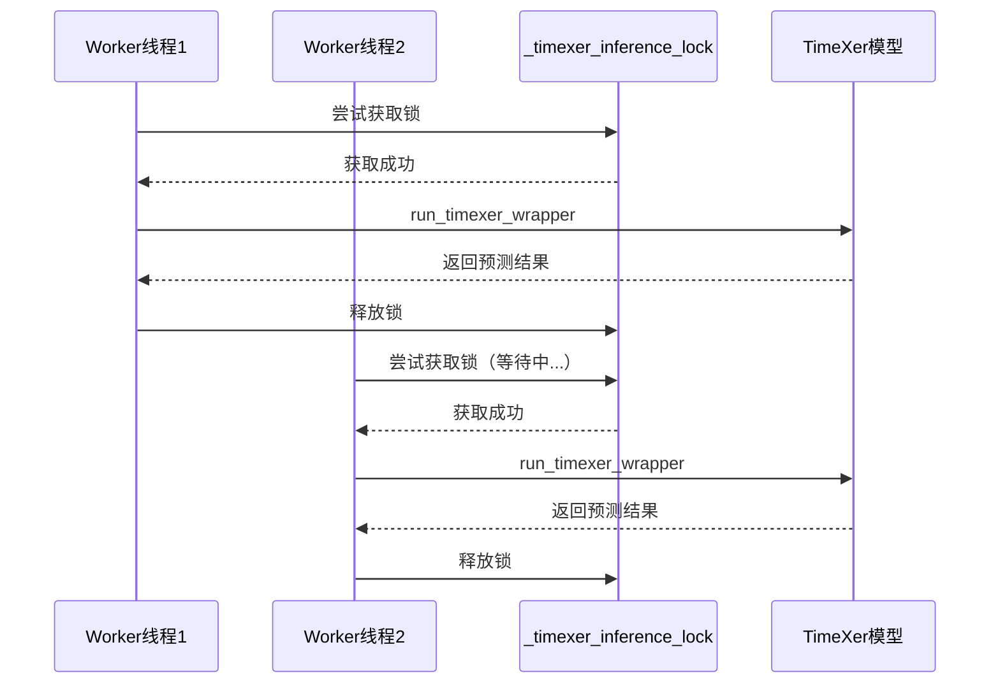

#### 2. 局部线程锁（worker函数中）

```python
lock2 = lock  # 传入的TimeXer锁
lock = threading.Lock()  # 局部XGB锁
```

**用途**:
- `lock2`: 主锁，用于TimeXer模型同步（实际指向 `_timexer_inference_lock`）
- `lock`: 局部锁，用于XGB模型的S3下载和加载同步

**锁的传递链**:
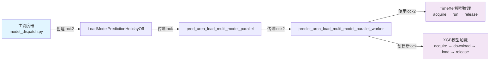

### 线程池管理

使用统一线程池 `get_thread_pool_executor()`:

```python
with get_thread_pool_executor() as executor:
    future = executor.submit(predict_area_load_multi_model_parallel_worker, ...)
    future.result()  # 等待完成
```

**优点**:
- 统一管理所有worker线程
- 避免创建过多线程导致资源耗尽
- 自动清理和回收资源

---

## 配置参数

### 运行模式

| 参数 | 值 | 说明 | 使用场景 |
|------|-----|------|----------|
| `mode` | 1 | 定时调度模式 | 每天20:00自动触发预测 |
| `mode` | 2 | 单次运行模式 | 立即执行一次预测 |

### 模型参数

| 参数 | 类型 | 说明 | 默认值 |
|------|------|------|--------|
| `exp_dlinear` | object | DLinear模型实例 | None |
| `exp_timexer` | object | TimeXer模型实例 | None |
| `target_points` | int | 目标时间点数量 | 2016 (7天 × 288点/天) |
| `past_days_num` | int | 历史数据天数 | 60 |

### 数据处理参数

| 参数 | 说明 | 值 |
|------|------|-----|
| `mode_type` | 假期模式类型 | 2 |
| `operation_type` | 操作类型 | 1=开启, 0=关闭 |
| `interval` | 时间间隔 | 300秒 (5分钟) |
| `batch_size` | 批次大小 | 20 (schedule) / 1 (call) |

### 时区处理参数

| 参数 | 类型 | 说明 |
|------|------|------|
| `gap_time` | tuple | 夏令时缺失小时 (start_time, end_time) |
| `winter_extra_time` | tuple | 冬令时重复小时 (start_time, end_time) |
| `time_area` | str | 时区名称（如 'Europe/Berlin'） |

---

## 使用示例

### 1. 定时调度模式（每天20:00执行）

```python
from load_pred_holiday_off_schedule import LoadModelPredictionHolidayOff
from multi_model_dispatch import load_model_checkpoints

# 1. 加载深度学习模型
dlinear_cks, timexer_cks = load_model_checkpoints(is_from_s3=True)
exp_dlinear = create_dlinear_instance(dlinear_cks)
exp_timexer = create_timexer_instance(timexer_cks)

# 2. 获取白名单
from model_dispatch import read_white_list_from_redis
global_white_list = read_white_list_from_redis(redis_conn_global, key='load-pred:white_list')

# 3. 创建线程锁
import threading
lock2 = threading.Lock()

# 4. 为每个时区创建定时线程
ai_area = ['Europe/Berlin', 'America/New_York', 'Asia/Shanghai']
thread_load_holiday_off_dict = {}

for each_area in ai_area:
    thread_load_holiday_off_dict[each_area] = LoadModelPredictionHolidayOff(
        each_area,
        mode=1,  # 定时调度模式
        exp_dlinear=exp_dlinear,
        exp_timexer=exp_timexer,
        global_white_list=global_white_list,
        lock=lock2
    )
    thread_load_holiday_off_dict[each_area].start()

# 5. 线程将在每天20:00自动执行预测
```

### 2. 按需调用模式（立即执行）

```python
from load_pred_holiday_off_call import pred_area_load_multi_model_parallel_holiday_off_call

# 1. 加载模型（同上）
dlinear_cks, timexer_cks = load_model_checkpoints(is_from_s3=True)
exp_dlinear = create_dlinear_instance(dlinear_cks)
exp_timexer = create_timexer_instance(timexer_cks)

# 2. 调用预测（针对单个站点）
station_id = 12024112800166
update_time = 1703030400  # 时间戳或日期字符串
holiday_mode = 0  # 必须为0才执行

success = pred_area_load_multi_model_parallel_holiday_off_call(
    station_id=station_id,
    exp_dlinear=exp_dlinear,
    exp_timexer=exp_timexer,
    update_time=update_time,
    holiday_mode=holiday_mode
)

if success:
    print(f"站点 {station_id} 预测成功")
else:
    print(f"站点 {station_id} 预测失败")
```

### 3. 单次运行模式（测试用）

```python
from load_pred_holiday_off_schedule import LoadModelPredictionHolidayOff

# 创建单次运行线程
thread = LoadModelPredictionHolidayOff(
    'Europe/Berlin',
    mode=2,  # 单次运行模式
    exp_dlinear=exp_dlinear,
    exp_timexer=exp_timexer,
    global_white_list=global_white_list,
    lock=lock2
)

# 启动线程立即执行
thread.start()
thread.join()  # 等待完成
```

---

## 故障排查

### 常见问题

#### 1. 假期关闭站点列表为空

**问题**: 日志显示 "假期关闭站点列表为空，跳过预测"

**原因**:
- 数据库 `get_ai_station_holiday_off` 查询结果为空
- 或者查询结果与 `ai_station` 交集为空

**解决方法**:
```python
# 检查数据库查询
global_holiday_off_list_all = db_conn_global.get_ai_station_holiday_off(pred_now_date.strftime('%Y-%m-%d'))
logger.info(f"全局假期关闭站点: {len(global_holiday_off_list_all)}")

ai_station = db_conn_global.get_ai_station(time_area)
logger.info(f"该时区AI站点: {len(ai_station)}")

# 检查交集
intersection = list(set(global_holiday_off_list_all) & set(ai_station))
logger.info(f"交集站点: {len(intersection)}")
```

#### 2. 站点数据过滤后不足2016个点

**问题**: 日志显示 "站点XXX移除假期后可用时间点不足2016个"

**原因**:
- 假期模式时间段太多，过滤后剩余数据不足
- 原始数据本身就不足60天

**解决方法**:
- 检查假期操作日志是否正确
- 检查 `extended_start_timestamp` 是否正确扩展（向前60天）
- 考虑降低 `target_points` 阈值（需修改代码）

#### 3. TimeXer模型推理超时

**问题**: TimeXer推理卡住，等待锁超时

**原因**:
- 多个worker线程同时请求TimeXer锁
- 前一个推理未正常释放锁

**解决方法**:
```python
# 添加超时机制
if lock2 is not None:
    acquired = lock2.acquire(timeout=300)  # 5分钟超时
    if not acquired:
        logger.error("获取TimeXer锁超时")
        continue
    try:
        batch_forecast_timexer_model(...)
    finally:
        lock2.release()
```

#### 4. XGBoost模型下载失败

**问题**: 日志显示 "从s3拉取站点XXX_模型GridXGB5fold-load-dayahead失败"

**原因**:
- S3连接问题
- 模型文件不存在
- 权限不足

**解决方法**:
```python
# 添加重试机制
max_retries = 3
for attempt in range(max_retries):
    try:
        s3_conn.download(f'pv_ai_model/{model}/{station_id}_{model}_model.pkl',
                         f'{station_id}_{model}_model.pkl')
        break
    except Exception as e:
        if attempt == max_retries - 1:
            logger.error(f"下载失败（已重试{max_retries}次）: {e}")
        else:
            logger.warning(f"下载失败，重试第{attempt+1}次...")
            time.sleep(5)
```

---

## 性能优化建议

### 1. 批次大小调整

当前批次大小:
- **schedule模式**: `batch_size=20`
- **call模式**: `batch_size=1`

**优化建议**:
```python
# 根据可用内存动态调整
import psutil
available_memory_gb = psutil.virtual_memory().available / (1024**3)

if available_memory_gb > 16:
    batch_size = 50
elif available_memory_gb > 8:
    batch_size = 20
else:
    batch_size = 10
```

### 2. 并行度控制

**当前实现**: 每个时区一个worker线程

**优化建议**:
```python
# 限制最大并发worker数量
from threading import Semaphore
max_concurrent_workers = 4
worker_semaphore = Semaphore(max_concurrent_workers)

with worker_semaphore:
    predict_area_load_multi_model_parallel_worker(...)
```

### 3. 内存管理优化

**当前实现**: 每个批次后调用 `gc.collect()`

**优化建议**:
```python
# 更积极的内存清理
import gc
import torch

# 在批次处理后
del batch_np, batch_df
if torch.cuda.is_available():
    torch.cuda.empty_cache()
gc.collect()

# 定期强制垃圾回收
if batch_count % 10 == 0:
    gc.collect(generation=2)
```

### 4. 数据库查询优化

**当前实现**: 每个站点单独查询假期mask

**优化建议**:
```python
# 批量查询所有站点的假期mask
def get_batch_holiday_mode_masks(station_ids, start_timestamp, end_timestamp):
    """批量获取多个站点的假期mask"""
    station_masks = {}

    # 一次性查询所有站点
    data = db_conn_global.get_batch_station_mode_operation_log(
        station_ids,
        extended_start_date,
        end_date,
        mode_type=2
    )

    # 分组处理
    for station_id in station_ids:
        station_data = [row for row in data if row[0] == station_id]
        station_masks[station_id] = process_holiday_periods(station_data)

    return station_masks
```

---

## 附录

### A. Kafka消息格式

```
格式: pred_date;station_id;pred_type;model;confidence;record_time;statistics_time;each_pred

示例:
2024-01-15;12024112800166;2;Dlinear-load-dayahead;0.1;1705315200;[1705276800,1705277100,...];[12.34567,13.45678,...]

字段说明:
- pred_date: 预测日期 (YYYY-MM-DD)
- station_id: 站点ID
- pred_type: 预测类型 (2=负荷预测)
- model: 模型名称
- confidence: 置信度 (固定0.1)
- record_time: 记录时间戳
- statistics_time: 时间戳列表（288个，5分钟间隔）
- each_pred: 预测值列表（288个，四舍五入到5位小数）
```

### B. 数据库表结构

#### sigen_ai.station_mode_operation_log

```sql
CREATE TABLE station_mode_operation_log (
    dt DATE,                    -- 日期
    mode_type INT,              -- 模式类型 (2=假期模式)
    operation_type INT,         -- 操作类型 (1=开启, 0=关闭)
    operation_time BIGINT,      -- 操作时间戳
    record_time BIGINT,         -- 记录时间戳
    station_id BIGINT,          -- 站点ID
    PRIMARY KEY (station_id, dt, operation_time)
);
```

### C. 模型输入输出规格

| 模型 | 输入形状 | 输出形状 | 说明 |
|------|----------|----------|------|
| DLinear | [n_stations, 2016, 2] | [n_stations, 576, 1] | 2016个历史点 → 576个预测点（2天） |
| TimeXer | [n_stations, 2016, 2] | [n_stations, 576, 1] | 2016个历史点 → 576个预测点（2天） |
| XGBoost | DataFrame with datetime index | DataFrame with datetime index | 逐站点预测，每次预测2天 |

**注**:
- 输入 `[:, :, 1]` 需要除以100进行归一化
- 输出需要乘以100进行反归一化
- 最终结果需要裁剪负值：`result[result < 0.0] = 0.0`

### D. 依赖关系图

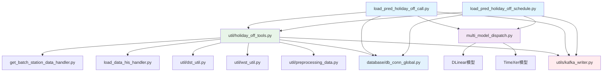

---

## 版本历史

| 版本 | 日期 | 修改内容 | 作者 |
|------|------|----------|------|
| 1.0 | 2024-12-24 | 初始版本，包含完整系统文档和流程图 | AI Assistant |

---

## 联系方式

如有问题或建议，请联系开发团队。

**文档生成时间**: 2024-12-24