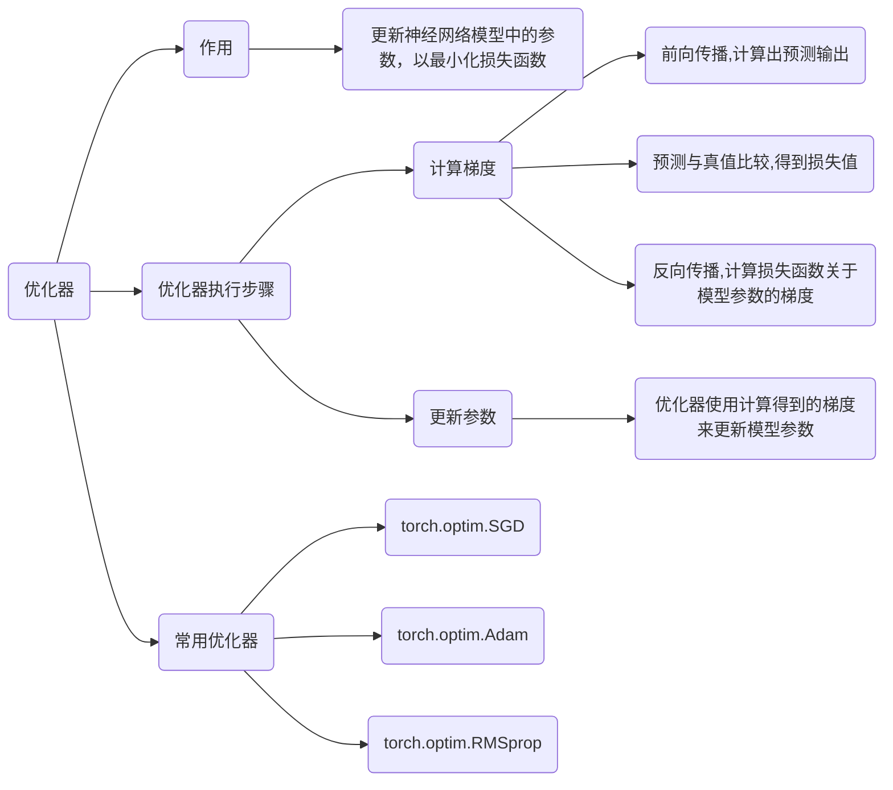

在 PyTorch 中，训练深度学习模型通常遵循以下步骤：

1. **加载数据**
   - 使用 `torch.utils.data.Dataset` 创建训练数据集和验证数据集。
   - 使用 `torch.utils.data.DataLoader` 创建数据加载器，以便于批量处理数据。
2. **定义模型**
   - 使用 `torch.nn.Module` 定义你的神经网络模型。
   - 如果使用 GPU，通过 `model.cuda()` 将模型移动到 GPU 上。
3. **定义损失函数和优化器**
   - 定义一个合适的损失函数，例如 `torch.nn.CrossEntropyLoss()`（用于分类问题）或 `torch.nn.MSELoss()`（用于回归问题）。
   - 选择一个优化器，例如 `torch.optim.Adam` 或 `torch.optim.SGD`，并传入模型参数和学习率等超参数。
4. **训练模型**
   - 将模型设置为训练模式：`model.train()`。
   - 遍历训练数据加载器中的每个批次：
     - 将输入数据和标签移动到 GPU（如果可用）。
     - 使用 `optimizer.zero_grad()` 清零梯度。
     - 使用模型进行前向传播，计算预测输出。
     - 使用损失函数计算损失值。
     - 使用 `loss.backward()` 进行反向传播，计算梯度。
     - 使用 `optimizer.step()` 更新模型参数。
5. **验证模型** （可选，但强烈推荐）
   - 将模型设置为评估模式：`model.eval()`。
   - 在 `torch.no_grad()` 上下文中执行验证过程，以禁用梯度计算。
   - 遍历验证数据加载器中的每个批次，计算模型在验证集上的性能指标（例如损失、准确率）。
6. **训练循环**
   - 定义训练的轮数（epoch）。
   - 对于每个 epoch：
     - 执行训练步骤，并记录训练损失。
     - 执行验证步骤，并记录验证损失或其他指标。
     - 打印或记录训练和验证的性能指标。
7. **保存模型** （可选）
   - 使用 `torch.save()` 函数保存模型的权重（`model.state_dict()`）或其他需要保存的信息。

下面是一个使用 PyTorch 训练模型的通用代码框架, 包含了通常所需的几个步骤：

```python
import torch
import torch.nn as nn
import torch.optim as optim
from torch.utils.data import DataLoader

# 1. 加载数据
train_dataset = ... # 创建训练数据集
train_loader = DataLoader(train_dataset, batch_size=32, shuffle=True) # 创建训练数据加载器
validation_dataset = ... # 创建验证数据集
validation_loader = DataLoader(validation_dataset, batch_size=32, shuffle=False) # 创建验证数据加载器

# 2. 定义模型
model = ... # 定义你的模型
model = model.cuda()  # 将模型移动到 GPU (如果可用)

# 3. 定义损失函数和优化器
criterion = nn.CrossEntropyLoss() # 例如：交叉熵损失
optimizer = optim.Adam(model.parameters(), lr=0.001) # 例如：Adam 优化器

# 4. 训练模型
def train_one_epoch(model, optimizer, criterion, train_loader, device):
    model.train() # 将模型设置为训练模式
    total_loss = 0
    for inputs, labels in train_loader:
        inputs = inputs.to(device) # 将输入数据移动到 GPU
        labels = labels.to(device) # 将标签移动到 GPU

        optimizer.zero_grad() # 清零梯度
        outputs = model(inputs) # 前向传播
        loss = criterion(outputs, labels) # 计算损失
        loss.backward() # 反向传播
        optimizer.step() # 更新模型参数
        total_loss += loss.item()
    return total_loss / len(train_loader)

# 5. 验证模型 (可选，但强烈推荐)
def validate_one_epoch(model, criterion, validation_loader, device):
    model.eval() # 将模型设置为评估模式
    total_loss = 0
    with torch.no_grad(): # 在验证过程中禁用梯度计算
        for inputs, labels in validation_loader:
            inputs = inputs.to(device)
            labels = labels.to(device)
            outputs = model(inputs)
            loss = criterion(outputs, labels)
            total_loss += loss.item()
    return total_loss / len(validation_loader)

# 6. 训练循环
num_epochs = 10 # 定义训练的轮数
device = torch.device("cuda" if torch.cuda.is_available() else "cpu") # 获取设备 (GPU 或 CPU)

for epoch in range(num_epochs):
    train_loss = train_one_epoch(model, optimizer, criterion, train_loader, device)
    validation_loss = validate_one_epoch(model, criterion, validation_loader, device)
    print(f"Epoch {epoch+1}/{num_epochs}, Train Loss: {train_loss:.4f}, Validation Loss: {validation_loss:.4f}")

# 7. 保存模型 (可选)
torch.save(model.state_dict(), 'model.pth') # 保存模型权重
```


## 优化器的作用




在 PyTorch 中，优化器 (Optimizer) 的作用是**更新神经网络模型中的参数，以最小化损失函数**。

更具体地说，训练神经网络的目标是找到一组参数（例如，权重和偏置），使得模型在给定输入数据上的预测结果与真实结果之间的差异（即损失）尽可能小。优化器通过以下步骤来实现这个目标：

1. **计算梯度 (Compute gradients)**:

   - 在训练过程中，模型首先对输入数据进行前向传播，计算出预测输出。
   - 然后，将预测输出与真实标签进行比较，得到损失值。
   - 接下来，通过反向传播算法，计算损失函数关于模型参数的梯度。梯度指示了参数应该如何调整才能使损失函数减小。

2. **更新参数 (Update parameters)**:

   - 优化器使用计算得到的梯度来更新模型的参数。

   - 更新规则由优化器中实现的算法决定。例如，对于最简单的随机梯度下降 (SGD) 优化器，参数更新规则如下：

     ```
     参数 = 参数 - 学习率 * 梯度 
     ```

     其中，“学习率”是一个控制参数更新步长的超参数。

   - 不同的优化器使用不同的更新规则，以更有效地最小化损失函数。例如，Adam 优化器使用自适应学习率，根据参数的历史梯度信息来调整每个参数的学习率。

PyTorch 提供了多种优化器，例如：

- `torch.optim.SGD`: 随机梯度下降
- `torch.optim.Adam`:  Adam 优化算法
- `torch.optim.RMSprop`: RMSProp 算法

选择合适的优化器和调整其超参数（例如学习率）对于训练出高性能的模型至关重要。

