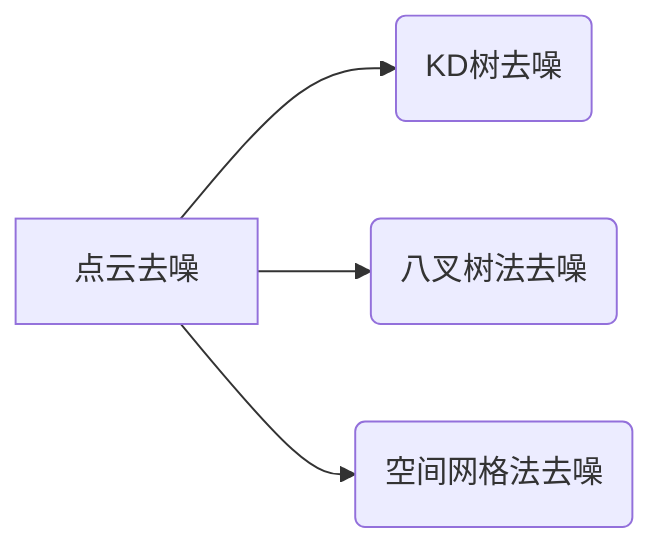

https://www.bilibili.com/opus/816962548474576961

点云去噪方法

https://blog.csdn.net/luolaihua2018/article/details/120211053

K-D树进行无序点云去噪

https://blog.51cto.com/u_16658015/10285842

kd-树详解

[机器学习算法（二十五）：KD树详解及KD树最近邻算法_kdtree最近邻算法-CSDN博客](https://blog.csdn.net/weixin_39910711/article/details/114447104)

点云配准：

ICP算法。

[ICP算法思想与推导详解——什么东西“最近点”，又“迭代”了什么？-CSDN博客](https://blog.csdn.net/littlefrogyq/article/details/126138732)

[【点云精配准】Iterative Closest Point（ICP） - 知乎](https://zhuanlan.zhihu.com/p/107218828)

[ICP算法详解——我见过最清晰的解释-CSDN博客](https://blog.csdn.net/qq_41685265/article/details/107140349)

​		这个讲解

[【PCL】—— 点云配准ICP(Iterative Closest Point)算法_icp点云配准-CSDN博客](https://blog.csdn.net/sinat_52032317/article/details/130441840)

这个公式推导也还行：

[ICP算法在点云匹配中的应用与实践](https://cloud.baidu.com/article/3227017)

https://cloud.baidu.com/article/3227017

[ICP算法思想与推导详解——什么东西“最近点”，又“迭代”了什么？-CSDN博客](https://blog.csdn.net/littlefrogyq/article/details/126138732)

​	这个比较形象

