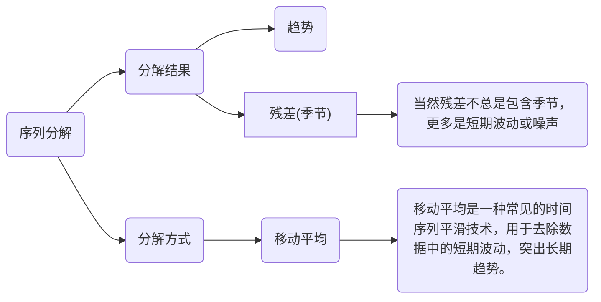

# Dlinear 学习笔记


## 代码部分

原版Dlinear

```python
import torch
import torch.nn as nn
import torch.nn.functional as F
import numpy as np

class moving_avg(nn.Module):
    """
    Moving average block to highlight the trend of time series
    """
    def __init__(self, kernel_size, stride):
        super(moving_avg, self).__init__()
        self.kernel_size = kernel_size
        self.avg = nn.AvgPool1d(kernel_size=kernel_size, stride=stride, padding=0)

    def forward(self, x):
        # padding on the both ends of time series
        front = x[:, 0:1, :].repeat(1, (self.kernel_size - 1) // 2, 1)
        end = x[:, -1:, :].repeat(1, (self.kernel_size - 1) // 2, 1)
        x = torch.cat([front, x, end], dim=1)
        x = self.avg(x.permute(0, 2, 1))
        x = x.permute(0, 2, 1)
        return x


class series_decomp(nn.Module):
    """
    Series decomposition block
    """
    def __init__(self, kernel_size):
        super(series_decomp, self).__init__()
        self.moving_avg = moving_avg(kernel_size, stride=1)

    def forward(self, x):
        moving_mean = self.moving_avg(x)
        res = x - moving_mean
        return res, moving_mean

class Model(nn.Module):
    """
    Decomposition-Linear
    """
    def __init__(self, configs):
        super(Model, self).__init__()
        self.seq_len = configs.seq_len
        self.pred_len = configs.pred_len

        # Decompsition Kernel Size
        kernel_size = 25
        self.decompsition = series_decomp(kernel_size)
        self.individual = configs.individual
        self.channels = configs.enc_in

        if self.individual:
            self.Linear_Seasonal = nn.ModuleList()
            self.Linear_Trend = nn.ModuleList()
            
            for i in range(self.channels):
                self.Linear_Seasonal.append(nn.Linear(self.seq_len,self.pred_len))
                self.Linear_Trend.append(nn.Linear(self.seq_len,self.pred_len))

                # Use this two lines if you want to visualize the weights
                # self.Linear_Seasonal[i].weight = nn.Parameter((1/self.seq_len)*torch.ones([self.pred_len,self.seq_len]))
                # self.Linear_Trend[i].weight = nn.Parameter((1/self.seq_len)*torch.ones([self.pred_len,self.seq_len]))
        else:
            self.Linear_Seasonal = nn.Linear(self.seq_len,self.pred_len)
            self.Linear_Trend = nn.Linear(self.seq_len,self.pred_len)
            
            # Use this two lines if you want to visualize the weights
            # self.Linear_Seasonal.weight = nn.Parameter((1/self.seq_len)*torch.ones([self.pred_len,self.seq_len]))
            # self.Linear_Trend.weight = nn.Parameter((1/self.seq_len)*torch.ones([self.pred_len,self.seq_len]))

    def forward(self, x):
        # x: [Batch, Input length, Channel]
        seasonal_init, trend_init = self.decompsition(x)
        seasonal_init, trend_init = seasonal_init.permute(0,2,1), trend_init.permute(0,2,1)
        if self.individual:
            seasonal_output = torch.zeros([seasonal_init.size(0),seasonal_init.size(1),self.pred_len],dtype=seasonal_init.dtype).to(seasonal_init.device)
            trend_output = torch.zeros([trend_init.size(0),trend_init.size(1),self.pred_len],dtype=trend_init.dtype).to(trend_init.device)
            for i in range(self.channels):
                seasonal_output[:,i,:] = self.Linear_Seasonal[i](seasonal_init[:,i,:])
                trend_output[:,i,:] = self.Linear_Trend[i](trend_init[:,i,:])
        else:
            seasonal_output = self.Linear_Seasonal(seasonal_init)
            trend_output = self.Linear_Trend(trend_init)

        x = seasonal_output + trend_output
        return x.permute(0,2,1) # to [Batch, Output length, Channel]

```


改造版本Dlinear

```python
import torch
import torch.nn as nn
import torch.nn.functional as F
import numpy as np

class moving_avg(nn.Module):
    """
    移动平均模块，用于突出时间序列的趋势
    """
    def __init__(self, kernel_size, stride):
        """
        初始化移动平均模块
        Args:
            kernel_size (int): 移动平均窗口大小
            stride (int): 移动平均步长
        """
        super(moving_avg, self).__init__()
        self.kernel_size = kernel_size
        # 使用一维平均池化实现移动平均
        self.avg = nn.AvgPool1d(kernel_size=kernel_size, stride=stride, padding=0)

    def forward(self, x):
        """
        前向传播函数
        Args:
            x (torch.Tensor): 输入张量，形状为 [批次大小, 序列长度, 通道数]
        Returns:
            torch.Tensor: 经过移动平均处理后的张量
        """
        # 在时间序列两端进行填充，以保持序列长度
        # 计算需要填充的长度
        padding_len = (self.kernel_size - 1) // 2
        # 复制第一个时间步的值进行前端填充
        front = x[:, 0:1, :].repeat(1, padding_len, 1)
        # 复制最后一个时间步的值进行后端填充
        end = x[:, -1:, :].repeat(1, padding_len, 1)
        # 拼接填充后的序列
        x = torch.cat([front, x, end], dim=1)
        # 调整维度以适应AvgPool1d (需要 [批次大小, 通道数, 序列长度])
        x = self.avg(x.permute(0, 2, 1))
        # 调整回原始维度 [批次大小, 序列长度, 通道数]
        x = x.permute(0, 2, 1)
        return x


class series_decomp(nn.Module):
    """
    序列分解模块
    """
    def __init__(self, kernel_size):
        """
        初始化序列分解模块
        Args:
            kernel_size (int): 用于移动平均的窗口大小
        """
        super(series_decomp, self).__init__()
        # 初始化移动平均模块，步长为1
        self.moving_avg = moving_avg(kernel_size, stride=1)

    def forward(self, x):
        """
        前向传播函数
        Args:
            x (torch.Tensor): 输入张量
        Returns:
            tuple(torch.Tensor, torch.Tensor): 返回残差（季节性）部分和趋势部分
        """
        # 计算移动平均值（趋势）
        moving_mean = self.moving_avg(x)
        # 计算残差（季节性）= 原始序列 - 趋势
        res = x - moving_mean
        return res, moving_mean

class MLP(nn.Module):
    """
    多层感知机，用于特征增强
    """
    def __init__(self, input_dim, hidden_dim, output_dim, dropout_rate=0.1):
        """
        初始化MLP模块
        Args:
            input_dim (int): 输入维度
            hidden_dim (int): 隐藏层维度
            output_dim (int): 输出维度
            dropout_rate (float): Dropout比率
        """
        super(MLP, self).__init__()
        self.fc1 = nn.Linear(input_dim, hidden_dim) # 第一个全连接层
        self.fc2 = nn.Linear(hidden_dim, output_dim) # 第二个全连接层
        self.dropout = nn.Dropout(dropout_rate) # Dropout层
        self.activation = nn.GELU() # GELU激活函数
        self.norm = nn.LayerNorm(output_dim) # 层归一化

    def forward(self, x):
        """
        前向传播函数
        Args:
            x (torch.Tensor): 输入张量
        Returns:
            torch.Tensor: 经过MLP处理后的张量
        """
        x = self.fc1(x)
        x = self.activation(x)
        x = self.dropout(x)
        x = self.fc2(x)
        x = self.norm(x)
        return x

class ConvBlock(nn.Module):
    """
    卷积模块，用于捕捉局部模式
    """
    def __init__(self, in_channels, out_channels, kernel_size=3):
        """
        初始化卷积模块
        Args:
            in_channels (int): 输入通道数
            out_channels (int): 输出通道数
            kernel_size (int): 卷积核大小
        """
        super(ConvBlock, self).__init__()
        # 一维卷积层，使用padding保持序列长度
        self.conv1 = nn.Conv1d(in_channels, out_channels, kernel_size, padding=kernel_size//2)
        # 批归一化层
        self.norm = nn.BatchNorm1d(out_channels)
        # GELU激活函数
        self.activation = nn.GELU()

    def forward(self, x):
        """
        前向传播函数
        Args:
            x (torch.Tensor): 输入张量，形状应为 [批次大小, 通道数, 序列长度]
        Returns:
            torch.Tensor: 经过卷积模块处理后的张量
        """
        x = self.conv1(x)
        x = self.norm(x)
        x = self.activation(x)
        return x

class SelfAttention(nn.Module):
    """
    自注意力机制，用于捕捉序列依赖关系
    """
    def __init__(self, embed_dim, num_heads=4, dropout=0.1):
        """
        初始化自注意力模块
        Args:
            embed_dim (int): 输入嵌入维度 (通常等于通道数)
            num_heads (int): 注意力头数
            dropout (float): Dropout比率
        """
        super(SelfAttention, self).__init__()
        # 多头注意力层，batch_first=True表示输入形状为 [批次大小, 序列长度, 嵌入维度]
        self.attention = nn.MultiheadAttention(embed_dim, num_heads, dropout=dropout, batch_first=True)
        # 层归一化
        self.norm = nn.LayerNorm(embed_dim)

    def forward(self, x):
        """
        前向传播函数
        Args:
            x (torch.Tensor): 输入张量，形状为 [批次大小, 序列长度, 嵌入维度]
        Returns:
            torch.Tensor: 经过自注意力处理后的张量
        """
        residual = x # 保存残差连接的原始输入
        # 计算注意力，Q, K, V 均为 x
        x, _ = self.attention(x, x, x)
        # 添加残差连接
        x = x + residual
        # 应用层归一化
        x = self.norm(x)
        return x

class Model(nn.Module):
    """
    增强的分解-线性模型 (Enhanced Decomposition-Linear model)
    """
    def __init__(self, configs):
        """
        初始化模型
        Args:
            configs (object): 包含模型配置参数的对象，例如：
                configs.seq_len (int): 输入序列长度
                configs.pred_len (int): 预测序列长度
                configs.individual (bool): 是否为每个通道使用独立的线性层
                configs.enc_in (int): 输入通道数 (特征数)
                configs.hidden_dim (int, optional): MLP和Attention的隐藏维度
                configs.dropout (float, optional): Dropout比率
                configs.use_mlp (bool, optional): 是否使用MLP模块
                configs.use_conv (bool, optional): 是否使用卷积模块
                configs.use_attn (bool, optional): 是否使用自注意力模块
        """
        super(Model, self).__init__()
        self.seq_len = configs.seq_len # 输入序列长度
        self.pred_len = configs.pred_len # 预测序列长度

        # 分解模块的核大小
        kernel_size = 25
        self.decompsition = series_decomp(kernel_size) # 序列分解模块实例
        self.individual = configs.individual # 是否为每个通道独立处理
        self.channels = configs.enc_in # 输入通道数

        # 高级建模参数 (如果configs中没有提供，则使用默认值)
        self.hidden_dim = getattr(configs, 'hidden_dim', 512) # 隐藏层维度
        self.dropout = getattr(configs, 'dropout', 0.1) # Dropout比率
        self.use_mlp = getattr(configs, 'use_mlp', True) # 是否启用MLP
        self.use_conv = getattr(configs, 'use_conv', True) # 是否启用卷积
        self.use_attn = getattr(configs, 'use_attn', True) # 是否启用自注意力

        # 根据配置条件性地初始化高级组件
        if self.use_mlp:
            # 为季节性和趋势分量分别初始化MLP
            self.mlp_seasonal = MLP(self.seq_len, self.hidden_dim, self.seq_len, self.dropout)
            self.mlp_trend = MLP(self.seq_len, self.hidden_dim, self.seq_len, self.dropout)

        if self.use_conv:
            # 为季节性和趋势分量分别初始化卷积模块
            self.conv_seasonal = ConvBlock(self.channels, self.channels)
            self.conv_trend = ConvBlock(self.channels, self.channels)

        if self.use_attn:
            # 为季节性和趋势分量分别初始化自注意力模块
            # 注意：SelfAttention的embed_dim通常等于通道数
            self.attn_seasonal = SelfAttention(self.channels, dropout=self.dropout)
            self.attn_trend = SelfAttention(self.channels, dropout=self.dropout)

        # 初始化最终的预测线性层
        if self.individual:
            # 如果为True，为每个通道创建独立的线性层
            self.Linear_Seasonal = nn.ModuleList()
            self.Linear_Trend = nn.ModuleList()

            for i in range(self.channels):
                self.Linear_Seasonal.append(nn.Linear(self.seq_len, self.pred_len))
                self.Linear_Trend.append(nn.Linear(self.seq_len, self.pred_len))
        else:
            # 如果为False，所有通道共享同一个线性层
            self.Linear_Seasonal = nn.Linear(self.seq_len, self.pred_len)
            self.Linear_Trend = nn.Linear(self.seq_len, self.pred_len)

    def forward(self, x):
        """
        模型的前向传播函数
        Args:
            x (torch.Tensor): 输入张量，形状为 [批次大小, 输入长度, 通道数]
        Returns:
            torch.Tensor: 模型的预测输出，形状为 [批次大小, 预测长度, 通道数]
        """
        # x: [批次大小, 输入长度, 通道数]
        # 1. 序列分解
        seasonal_init, trend_init = self.decompsition(x)

        # 2. 应用增强的特征处理 (可选)
        if self.use_attn:
            # 应用自注意力 (输入形状: [批次, 长度, 通道数])
            seasonal_init = self.attn_seasonal(seasonal_init)
            trend_init = self.attn_trend(trend_init)

        if self.use_conv:
            # 应用卷积 (需要形状: [批次, 通道数, 长度])
            seasonal_conv = self.conv_seasonal(seasonal_init.permute(0, 2, 1))
            trend_conv = self.conv_trend(trend_init.permute(0, 2, 1))
            # 转换回 [批次, 长度, 通道数]
            seasonal_init = seasonal_conv.permute(0, 2, 1)
            trend_init = trend_conv.permute(0, 2, 1)

        # 为了进行线性投影和可能的MLP处理，将维度调整为 [批次, 通道数, 长度]
        seasonal_init, trend_init = seasonal_init.permute(0, 2, 1), trend_init.permute(0, 2, 1)

        if self.use_mlp:
            # 应用MLP (输入形状: [批次, 通道数, 长度])
            # 初始化输出张量
            seasonal_processed = torch.zeros_like(seasonal_init)
            trend_processed = torch.zeros_like(trend_init)

            # 逐通道应用MLP
            for i in range(self.channels):
                 # MLP 输入形状: [批次, 长度] (针对每个通道)
                seasonal_processed[:, i, :] = self.mlp_seasonal(seasonal_init[:, i, :])
                trend_processed[:, i, :] = self.mlp_trend(trend_init[:, i, :])

            # 更新处理后的分量
            seasonal_init = seasonal_processed
            trend_init = trend_processed

        # 3. 最终预测
        if self.individual:
            # 如果每个通道独立预测
            # 初始化输出张量
            seasonal_output = torch.zeros([seasonal_init.size(0), seasonal_init.size(1), self.pred_len],
                                          dtype=seasonal_init.dtype).to(seasonal_init.device)
            trend_output = torch.zeros([trend_init.size(0), trend_init.size(1), self.pred_len],
                                       dtype=trend_init.dtype).to(trend_init.device)

            # 逐通道应用对应的线性层
            for i in range(self.channels):
                # 线性层输入形状: [批次, 输入长度] (针对每个通道)
                seasonal_output[:, i, :] = self.Linear_Seasonal[i](seasonal_init[:, i, :])
                trend_output[:, i, :] = self.Linear_Trend[i](trend_init[:, i, :])
        else:
            # 如果所有通道共享线性层
            # 线性层输入形状: [批次, 通道数, 输入长度]
            seasonal_output = self.Linear_Seasonal(seasonal_init)
            trend_output = self.Linear_Trend(trend_init)
            # 输出形状: [批次, 通道数, 预测长度]

        # 4. 合并输出
        # 将季节性和趋势性的预测结果相加
        x = seasonal_output + trend_output

        # 调整输出维度为 [批次大小, 预测长度, 通道数]
        return x.permute(0, 2, 1)

```


## 对于序列分解模块的理解





在您提供的代码中，`moving_avg` 模块用于对时间序列进行平滑处理，以提取其趋势部分。由于卷积操作在边缘处无法完整地覆盖窗口，因此需要对序列进行填充，以保持输出序列的长度与输入序列一致。具体而言，填充操作通过在序列的前后添加重复的边缘值来实现，这样可以在应用平均池化时避免边缘信息的丢失。这种填充方法确保了移动平均操作的中心性，即每个输出值对应于输入序列中一个对称窗口的平均值。

序列分解模块 `series_decomp` 通过将输入序列分解为趋势和残差（季节性）两个部分，帮助模型更好地理解和预测时间序列数据。趋势部分反映了数据的长期变化趋势，而残差部分则捕捉了短期的波动和季节性模式。这种分解方法有助于模型分别处理不同的时间序列成分，从而提高预测的准确性。

在实际应用中，移动平均是一种常见的时间序列平滑技术，用于去除数据中的短期波动，突出长期趋势。通过将时间序列分解为趋势和残差，模型可以更专注于各自的特征，提高对复杂时间序列的建模能力。

如果您有进一步的问题或需要更详细的解释，请随时提问。

